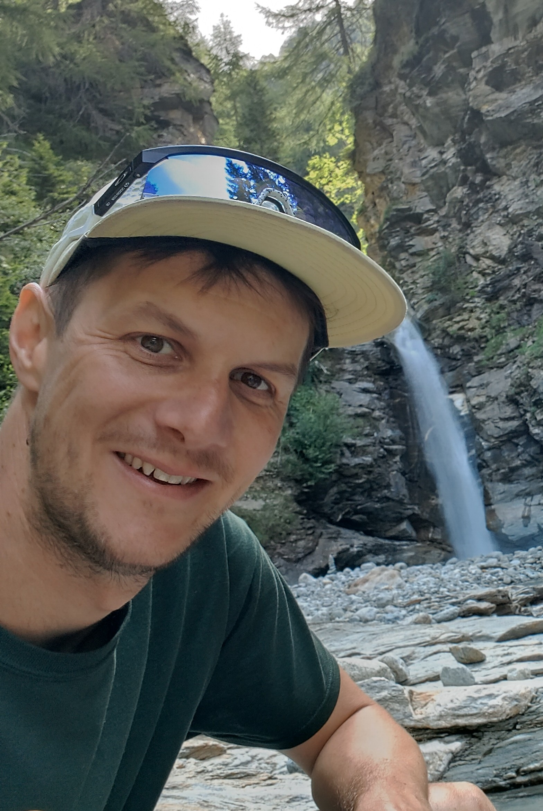

## James Bond Start {.center}

<iframe src="https://giphy.com/embed/Mz6oZpw81uKQg" width="480" height="363" frameBorder="0" class="giphy-embed" allowFullScreen></iframe>

::: footer
[via GIPHY (not CC-BY-NC-SA licensed)](https://giphy.com/gifs/james-bond-007-Mz6oZpw81uKQg)
:::


## [Markdown / Quarto](https://quarto.org/docs/guide/) {.center}

## AI Integration {.center}

## Containers / Docker {.center}


## [Background Survey](https://h4sci.kof.ethz.ch/) {.center}

```{r, echo=FALSE}
library(qrcode)

q <- qrcode::qr_code("https://h4sci.kof.ethz.ch/")
plot(q)

```

# Course Objectives

## 1. Evaluate the Role of Components in the Tech Stack {.center}


## 2. Carpentry Level Version Control + Dev Workflows {.center}


## 3. Applied Data Handling /w Programming Language {.center}


## Example Benchmark: [Create a Production Pipeline](https://github.com/h4sci/h4sci-gha-demo) {.center}


# Approach 

##

<center><iframe src="https://giphy.com/embed/l3q2V33TgyQ4hdfna" width="480" height="240" frameBorder="0" class="giphy-embed" allowFullScreen></iframe></center>

::: footer
[via GIPHY (not CC-BY-NC-SA licensed)](https://giphy.com/gifs/apprenticenbc-television-talking-l3q2V33TgyQ4hdfna">via GIPHY)
:::


## Coaching


<center><iframe src="https://giphy.com/embed/1zkMbX7k4nd1AM4i4k" width="480" height="480" frameBorder="0" class="giphy-embed" allowFullScreen></iframe><center>

::: footer
[via GIPHY (not CC-BY-NC-SA licensed)](https://giphy.com/gifs/lfc-friday-feeling-klopp-jrgen-1zkMbX7k4nd1AM4i4k)
:::


## Approach: Flipped Classroom

<center><iframe src="https://giphy.com/embed/l0HlUND0GA3ehpj1K" width="480" height="270" frameBorder="0" class="giphy-embed" allowFullScreen></iframe></center>

::: footer
[via GIPHY](https://giphy.com/gifs/southparkgifs-l0HlUND0GA3ehpj1K)
:::


## Schedule: Block 1 {.center}


25.09.	10-13	The Big Picture

26.9.	10-14	Git & Workflows

## Schedule: Block 2 {.center}

23.10.	10-13	R Programming Crash Course

24.10.	10-14	Programming with Data

## Schedule: Block 3 {.center}


20.11.	10-13	Infrastructure

21.11.	10-14	Infrastructure

## Schedule: Block 4 {.center}

04.12.	10-13	Semester Projects

05.12.	10-14	Semester Projects


# Course Resources


## Read Online

- [h4sci Slides](https://h4sci.github.io/h4sci-course)
- [Research Software Engineering - A Guide to Open Source Ecosystem (Online Book)](https://rse-book.github.io)
- [Tasks & Exercises](https://github.com/h4sci/h4sci-tasks)

## Source

- [Slides: https://github.com/h4sci/h4sci-course](https://github.com/h4sci/h4sci-course)
- [Book: https://github.com/rse-book](https://github.com/devops-carpentry/book)

## Community

- Matrix Chat Space (#h4sci:staffchat.ethz.ch) (element.io is recommended as a client)
- Zoom Live Sessions (only available to enrolled students)

## [The Big Picture](https://h4sci.github.io/h4sci-course/block_1_session_2_big_picture.html#/title-slide) {.center}


# The Git Session

## Tomorrow's Git Session 

- 10-12: Self Learning Block: Videos, Book, Trying Out (chat presence). Don't forget to take a break !
- Quick concept review: 15 min
- Q&A session (15 min)
- Breakout Rooms to work on the tasks (45 min)
- Task Review 30 min


## Individual Introductions {.center}


## Hi, I'm Matt.

:::: {.columns}


::: {.column width="60%" }

- AI & Analytics Services at Helsana 

- Research Software Engineering and Economic Data (RSEED) at KOF Lab ETH Zurich 

- formerly: Sales Lead [@cynkra](https://cynkra.com)

- active in the open source community, e.g., former global coordinator for the useR! conference, currently [Zurich R user group](https://zurich-r-user-group.github.io/)

:::


::: {.column width="40%" }

{fig-align="center" height="400"}

:::

::::


<!--
recordings from 2021: https://ethz.zoom.us/recording/detail?meeting_id=ZdBWsHpgRk6urwzsBpZKOg%3D%3D

 -->
