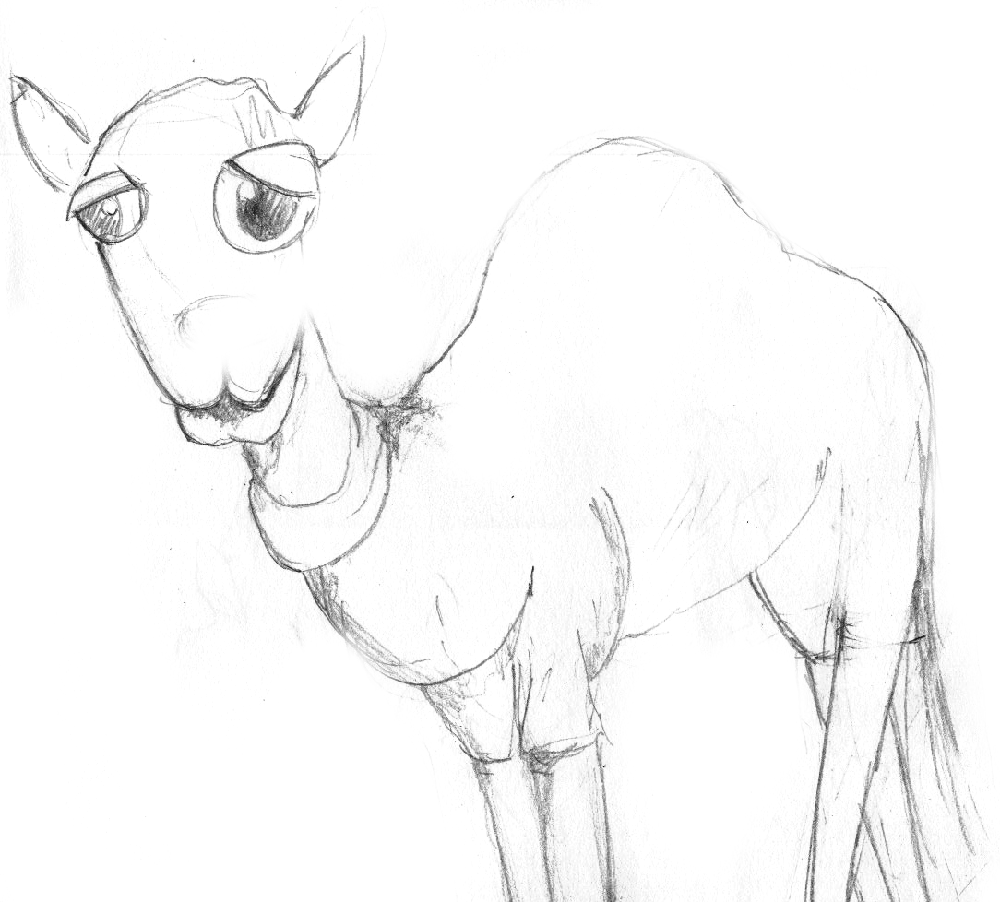
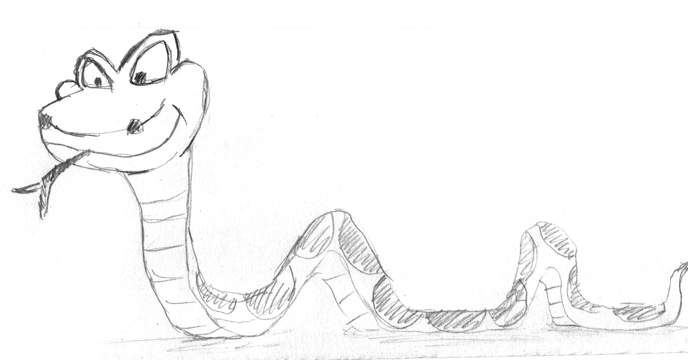

class:center,middle


**Today's goals**:</br>
Take away a programming trick (or two),
</br> get a better idea of how to structure code 


<div class="my-footer"><span><div class="footer-text" align="right">"Hacking for Social Sciences" by Dr. Matthias Bannert is licensed under <a href="https://creativecommons.org/licenses/by-nc-sa/4.0/?ref=chooser-v1">CC BY-NC-SA 4.0</a></div></span></div> 


---


## Most Popular Scripting Languages in Data Science

.pull-left[


- [R Language for Statistical Computing](https://r-project.org)
- [Stackoverflow questions](https://stackoverflow.com/questions/tagged/r): 300K+
- Recommended Editor: [R Studio IDE](https://rstudio.com/products/rstudio/)
- Extensions
  - [CRAN](https://cran.r-project.org/) Repository /w ~15K Extension packages
  - [Shiny Web Framework](http://shiny.rstudio.com/)
- Trend: from Domain Specific to General Purpose


]

.pull-right[


- Python [2](https://www.python.org/downloads/release/python-272/) & [3](https://www.python.org/)
- [Stackoverflow questions](https://stackoverflow.com/questions/tagged/python): ~1.3M+
- Recommended Editor: [Visual Studio Code /w Jupyter Notebooks](https://code.visualstudio.com/docs/python/jupyter-support)
- Extensions
  - [anaconda](https://www.anaconda.com/)
  - [pandas](https://pandas.pydata.org/)
  - [numpy](https://numpy.org/)
  - [sciPy](https://www.scipy.org/)
- Trend: General Purpose /w Scientific Extensions

]


<div class="my-footer"><span><div class="footer-text" align="right">"Hacking for Social Sciences" by Dr. Matthias Bannert is licensed under <a href="https://creativecommons.org/licenses/by-nc-sa/4.0/?ref=chooser-v1">CC BY-NC-SA 4.0</a></div></span></div> 


---

## Basic Object Types in R: vector

<!-- Go past "understand" in blooms Taxonomy: remember, understand, apply, analyze, evaluate, create --> 


```{r}
a <- 1
b <- c(1,2,6,20,30,40,100,200,300)
d <- 1:10
a
b
d
```

- scalar: vector of length one. 
- all elements have the same data type -> coercion to smallest common denominator.

<div class="my-footer"><span><div class="footer-text" align="right">"Hacking for Social Sciences" by Dr. Matthias Bannert is licensed under <a href="https://creativecommons.org/licenses/by-nc-sa/4.0/?ref=chooser-v1">CC BY-NC-SA 4.0</a></div></span></div> 

<div class="my-footer"><span><div class="footer-text" align="right">"Hacking for Social Sciences" by Dr. Matthias Bannert is licensed under <a href="https://creativecommons.org/licenses/by-nc-sa/4.0/?ref=chooser-v1">CC BY-NC-SA 4.0</a></div></span></div> 


---

## Basic Data Types in R: matrix

```{r}
m <- matrix(b, nrow = 3)
m
```

- two dimensional.
- all columns are of the *same length*.
- all elements have the *same data type*.


<div class="my-footer"><span><div class="footer-text" align="right">"Hacking for Social Sciences" by Dr. Matthias Bannert is licensed under <a href="https://creativecommons.org/licenses/by-nc-sa/4.0/?ref=chooser-v1">CC BY-NC-SA 4.0</a></div></span></div> 


---

## Basic Data Types in R: data.frame

```{r}
d <- data.frame(col1 = b[1:3],
                col2 = b[4:6],
                col3 = letters[1:3])
d
```

- two dimensional.
- all columns are of the *same length*.
- elements may have *different data types*.


<div class="my-footer"><span><div class="footer-text" align="right">"Hacking for Social Sciences" by Dr. Matthias Bannert is licensed under <a href="https://creativecommons.org/licenses/by-nc-sa/4.0/?ref=chooser-v1">CC BY-NC-SA 4.0</a></div></span></div> 


---


## Basic Data Types in R: list

```{r}
l <- list(element1 = a,
          element2 = m, 
          element3 = d)
l

```

- may be nested
- may have different data types


<div class="my-footer"><span><div class="footer-text" align="right">"Hacking for Social Sciences" by Dr. Matthias Bannert is licensed under <a href="https://creativecommons.org/licenses/by-nc-sa/4.0/?ref=chooser-v1">CC BY-NC-SA 4.0</a></div></span></div> 


---

## Environments


```{r}
e <- new.env()
e$cow <- "moooooo."
e$duck <- "quack."
e$dog <- "woof."

ls(e)
get("dog", envir = e)

```

- Be aware of lexical scoping (look up of variables in parent environments when they can't be found in the current environment) when working with functions.

- The section on [environment basics in Hadley Wickham's Advanced R](http://adv-r.had.co.nz/Environments.html) is a good, 
applied introduction.

- [How R Searches and Finds Stuff](http://blog.obeautifulcode.com/R/How-R-Searches-And-Finds-Stuff/) goes much further down the rabbit hole. 


<div class="my-footer"><span><div class="footer-text" align="right">"Hacking for Social Sciences" by Dr. Matthias Bannert is licensed under <a href="https://creativecommons.org/licenses/by-nc-sa/4.0/?ref=chooser-v1">CC BY-NC-SA 4.0</a></div></span></div> 


---


## Functional Programming


.pull-left[

```{r,eval=FALSE}
ds_list <- list(iris = iris,
                mtcars = mtcars)
lapply(ds_list, summary)
```

```{r,eval=FALSE}

lapply(ds_list, function(x){
  sprintf(
    "The dataset contains %d observations.",
    nrow(x))
})


```


]

.pull-right[

```{r,echo=FALSE}
ds_list <- list(iris = iris,
                mtcars = mtcars)
lapply(ds_list, nrow)

```


```{r,echo=FALSE}

lapply(ds_list, function(x){
  sprintf(
    "The dataset contains %d observations.",
          nrow(x)
    )
})


```


]


</br>
</br>
</br>

=> for more elaborate examples, such as function factories, take a read the [Functional Programming Chapter](http://adv-r.had.co.nz/Functional-programming.html) of Hadley Wickham's book.

<div class="my-footer"><span><div class="footer-text" align="right">"Hacking for Social Sciences" by Dr. Matthias Bannert is licensed under <a href="https://creativecommons.org/licenses/by-nc-sa/4.0/?ref=chooser-v1">CC BY-NC-SA 4.0</a></div></span></div> 


---


## Try Catch

.pull-left[

### Without Safety Net

```{r, eval=FALSE}

do_numeric_op <- function(a,b){
  out <- (a + b)*a
  message(sprintf(
    "'%s', '%s' were your inputs.",
    a,b)
    )
  out
}


do_numeric_op(1,"a")

```


]

<div class="my-footer"><span><div class="footer-text" align="right">"Hacking for Social Sciences" by Dr. Matthias Bannert is licensed under <a href="https://creativecommons.org/licenses/by-nc-sa/4.0/?ref=chooser-v1">CC BY-NC-SA 4.0</a></div></span></div> 


---

## Try Catch


.pull-left[

### Without Safety Net

```{r, eval=FALSE}

do_numeric_op <- function(a,b){
  out <- (a + b)*a
  message(sprintf(
    "'%s', '%s' were your inputs.",
    a,b)
    )
  out
}

do_numeric_op(1,"a")

```

"Error in a + b : non-numeric argument to binary operator Calls: [...]"


]


<div class="my-footer"><span><div class="footer-text" align="right">"Hacking for Social Sciences" by Dr. Matthias Bannert is licensed under <a href="https://creativecommons.org/licenses/by-nc-sa/4.0/?ref=chooser-v1">CC BY-NC-SA 4.0</a></div></span></div> 


---


## Try Catch


.pull-left[

### Without Safety Net

```{r, eval=FALSE}

do_numeric_op <- function(a,b){
  out <- (a + b)*a
  message(sprintf(
    "'%s', '%s' were your inputs.",
    a,b)
    )
  out
}

do_numeric_op(1,"a")

```

"Error in a + b : non-numeric argument to binary operator Calls: [...]"


]


.pull-right[

### Safety Net

```{r}

do_numeric_op <- function(a,b){
  
  tryCatch({
    return((a + b)*a)
  
  }, error = function(e) message(
    "Operation went wrong, but function is alive."
    )
  )
  sprintf("'%s', '%s' were your inputs.", a,b)
}


```


]


<div class="my-footer"><span><div class="footer-text" align="right">"Hacking for Social Sciences" by Dr. Matthias Bannert is licensed under <a href="https://creativecommons.org/licenses/by-nc-sa/4.0/?ref=chooser-v1">CC BY-NC-SA 4.0</a></div></span></div> 


---


## Try Catch


.pull-left[

### Without Safety Net

```{r, eval=FALSE}

do_numeric_op <- function(a,b){
  out <- (a + b)*a
  message(sprintf(
    "'%s', '%s' were your inputs.",
    a,b)
    )
  out
}

do_numeric_op(1,"a")

```

"Error in a + b : non-numeric argument to binary operator Calls: [...]"


]


.pull-right[

### Safety Net

```{r}

do_numeric_op <- function(a,b){
  
  tryCatch({
    return((a + b)*a)
  
  }, error = function(e) message(
    "Operation went wrong, but function is alive."
    )
  )
  sprintf("'%s', '%s' were your inputs.", a,b)
}

do_numeric_op(2,1)


```


]


<div class="my-footer"><span><div class="footer-text" align="right">"Hacking for Social Sciences" by Dr. Matthias Bannert is licensed under <a href="https://creativecommons.org/licenses/by-nc-sa/4.0/?ref=chooser-v1">CC BY-NC-SA 4.0</a></div></span></div> 


---


## Try Catch

.pull-left[

### Without Safety Net

```{r, eval=FALSE}

do_numeric_op <- function(a,b){
  out <- (a + b)*a
  message(sprintf(
    "'%s', '%s' were your inputs.",
    a,b)
    )
  out
}

do_numeric_op(1,"a")

```

"Error in a + b : non-numeric argument to binary operator Calls: [...]"


]


.pull-right[

### Safety Net

```{r}

do_numeric_op <- function(a,b){
  
  tryCatch({
    return((a + b)*a)
  
  }, error = function(e) message(
    "Operation went wrong, but function is alive."
    )
  )
  sprintf("'%s', '%s' were your inputs.", a,b)
}

do_numeric_op(2,1)
do_numeric_op(1,"a")

```


]


<div class="my-footer"><span><div class="footer-text" align="right">"Hacking for Social Sciences" by Dr. Matthias Bannert is licensed under <a href="https://creativecommons.org/licenses/by-nc-sa/4.0/?ref=chooser-v1">CC BY-NC-SA 4.0</a></div></span></div> 


---


## Parallel Computing

- throughput problem or not? 
- profile & benchmark (performance not necessarily linear)
- overhead vs. performance gain
- memory
- OS specific

=> Live Demo


<div class="my-footer"><span><div class="footer-text" align="right">"Hacking for Social Sciences" by Dr. Matthias Bannert is licensed under <a href="https://creativecommons.org/licenses/by-nc-sa/4.0/?ref=chooser-v1">CC BY-NC-SA 4.0</a></div></span></div> 


---


class: center, middle


## Structure Your Code

Naming Conventions </br>
Think: Package / Library </br>
Approaches


<div class="my-footer"><span><div class="footer-text" align="right">"Hacking for Social Sciences" by Dr. Matthias Bannert is licensed under <a href="https://creativecommons.org/licenses/by-nc-sa/4.0/?ref=chooser-v1">CC BY-NC-SA 4.0</a></div></span></div> 


---

class: center, middle

## Howdie, iAmACamel ! 



frequently occurs in: class names (mostly UpperCamelCase).

<div class="my-footer"><span><div class="footer-text" align="right">"Hacking for Social Sciences" by Dr. Matthias Bannert is licensed under <a href="https://creativecommons.org/licenses/by-nc-sa/4.0/?ref=chooser-v1">CC BY-NC-SA 4.0</a></div></span></div> 


---

class: center, middle

## Whassssssup, i_am_a_snake!



frequently occurs in: file and folder names, function names in R and Python.

<div class="my-footer"><span><div class="footer-text" align="right">"Hacking for Social Sciences" by Dr. Matthias Bannert is licensed under <a href="https://creativecommons.org/licenses/by-nc-sa/4.0/?ref=chooser-v1">CC BY-NC-SA 4.0</a></div></span></div> 


---


class: center, middle

## Hello, i-am-a-kebap! 


frequently occurs in: folder, file and repository names.


<div class="my-footer"><span><div class="footer-text" align="right">Kebap Picture by Chemipanda, CC BY-SA 4.0, via Wikimedia Commons. "Hacking for Social Sciences" by Dr. Matthias Bannert is licensed under <a href="https://creativecommons.org/licenses/by-nc-sa/4.0/?ref=chooser-v1">CC BY-NC-SA 4.0</a></div></span></div> 


---


class: center, middle

# Think: Package / Library

<div class="my-footer"><span><div class="footer-text" align="right">"Hacking for Social Sciences" by Dr. Matthias Bannert is licensed under <a href="https://creativecommons.org/licenses/by-nc-sa/4.0/?ref=chooser-v1">CC BY-NC-SA 4.0</a></div></span></div> 


---


## Script vs. Function -- Call vs. Definition

.pull-left[

```{r}
set.seed(123)
d1 <- rnorm(1000)
d2 <- rnorm(1000)

d1_mean <- mean(d1)
d1_sd <- sd(d1)
d1_q <- quantile(d1)
desc_stats_d1 <- list(d1_mean = d1_mean,
                      d1_sd = d1_sd,
                      d1_q = d1_q)

d2_mean <- mean(d2)
d2_sd <- sd(d2)
d2_q <- quantile(d2)
desc_stats_d2 <- list(d2_mean = d2_mean,
                      d2_sd = d2_sd,
                      d2_q = d2_q)


```

]


.pull-right[


]


<div class="my-footer"><span><div class="footer-text" align="right">"Hacking for Social Sciences" by Dr. Matthias Bannert is licensed under <a href="https://creativecommons.org/licenses/by-nc-sa/4.0/?ref=chooser-v1">CC BY-NC-SA 4.0</a></div></span></div> 


---


## Script vs. Function -- Call vs. Definition

.pull-left[

```{r}
set.seed(123)
d1 <- rnorm(1000)
d2 <- rnorm(1000)

d1_mean <- mean(d1)
d1_sd <- sd(d1)
d1_q <- quantile(d1)
desc_stats_d1 <- list(d1_mean = d1_mean,
                      d1_sd = d1_sd,
                      d1_q = d1_q)

d2_mean <- mean(d2)
d2_sd <- sd(d2)
d2_q <- quantile(d2)
desc_stats_d2 <- list(d2_mean = d2_mean,
                      d2_sd = d2_sd,
                      d2_q = d2_q)


```

]


.pull-right[

```{r}

create_basic_desc <- function(distr){
  out <- list(
    mean = mean(distr),
    sd = sd(distr),
    quantiles = quantile(distr)
  )
  out
}


```


]


<div class="my-footer"><span><div class="footer-text" align="right">"Hacking for Social Sciences" by Dr. Matthias Bannert is licensed under <a href="https://creativecommons.org/licenses/by-nc-sa/4.0/?ref=chooser-v1">CC BY-NC-SA 4.0</a></div></span></div> 


---


## Script vs. Function -- Call vs. Definition

.pull-left[

```{r}
set.seed(123)
d1 <- rnorm(1000)
d2 <- rnorm(1000)

d1_mean <- mean(d1)
d1_sd <- sd(d1)
d1_q <- quantile(d1)
desc_stats_d1 <- list(d1_mean = d1_mean,
                      d1_sd = d1_sd,
                      d1_q = d1_q)

d2_mean <- mean(d2)
d2_sd <- sd(d2)
d2_q <- quantile(d2)
desc_stats_d2 <- list(d2_mean = d2_mean,
                      d2_sd = d2_sd,
                      d2_q = d2_q)


```

]


.pull-right[
```{r}

create_basic_desc <- function(distr){
  out <- list(
    mean = mean(distr),
    sd = sd(distr),
    quantiles = quantile(distr)
  )
  out
}

create_basic_desc(d1)


```


]


<div class="my-footer"><span><div class="footer-text" align="right">"Hacking for Social Sciences" by Dr. Matthias Bannert is licensed under <a href="https://creativecommons.org/licenses/by-nc-sa/4.0/?ref=chooser-v1">CC BY-NC-SA 4.0</a></div></span></div> 


---


## Documentation of Functions (Reference)


.pull-left[

```{r}

#' Create Basic Descriptive Statistics
#'
#' Creates means, standard deviations and
#' default quantiles from an numeric input vector. 
#' 
#' @param distr numeric vector drawn
#' from an arbitraty distribution. 
#' @export 
create_basic_desc <- function(distr){
  out <- list(
    mean = mean(distr),
    sd = sd(distr),
    quantiles = quantile(distr)
  )
  out
}


```


]

.pull-right[

- Roxygen documentation can be rendered .Rd and .html
- package require documentation of every exported function

]


<div class="my-footer"><span><div class="footer-text" align="right">"Hacking for Social Sciences" by Dr. Matthias Bannert is licensed under <a href="https://creativecommons.org/licenses/by-nc-sa/4.0/?ref=chooser-v1">CC BY-NC-SA 4.0</a></div></span></div> 


---


## Folder Structure

- **R** function definitions
- **man** references (functions and datasets)
- **docs** Articles for GitHub Pages
- **vignettes** Articles' source, elaborate documentation source
- **inst** additional material, installed with package, e.g., sql files
- **src** source code that needs to be compiled, e.g., C++
- **tests** automated tests, often created with a testing framework such as [testthat](https://cran.r-project.org/web/packages/testthat/index.html) or [tinytest](https://cran.r-project.org/web/packages/tinytest/index.html)

- In addition every package needs DESCRIPTION and NAMESPACE file. 
- start with an _sandbox.R_ file in the root folder (may be moved to inst/ later on.). 
- move functions to the R/ folder once they get more mature (documentation, tested)


<div class="my-footer"><span><div class="footer-text" align="right">"Hacking for Social Sciences" by Dr. Matthias Bannert is licensed under <a href="https://creativecommons.org/licenses/by-nc-sa/4.0/?ref=chooser-v1">CC BY-NC-SA 4.0</a></div></span></div> 


---


## Approaches

- Document Before You Start, e.g., write a vignette outline
- use pseudo code or comments to structure 
- Peer programming in the beginning (make sure to switch who's on the driver's seat)
- Reproducible Research (include )

<div class="my-footer"><span><div class="footer-text" align="right">"Hacking for Social Sciences" by Dr. Matthias Bannert is licensed under <a href="https://creativecommons.org/licenses/by-nc-sa/4.0/?ref=chooser-v1">CC BY-NC-SA 4.0</a></div></span></div> 


---

class: center, middle

## Where Are You At (in Terms of Bloom's Taxonomy)? 

remember, understand, **apply**, **analyze**, **evaluate**, **create**


 => [Take the survey](https://h4sci.shinyapps.io/prog-feedback/)


<div class="my-footer"><span><div class="footer-text" align="right">"Hacking for Social Sciences" by Dr. Matthias Bannert is licensed under <a href="https://creativecommons.org/licenses/by-nc-sa/4.0/?ref=chooser-v1">CC BY-NC-SA 4.0</a></div></span></div> 


---


