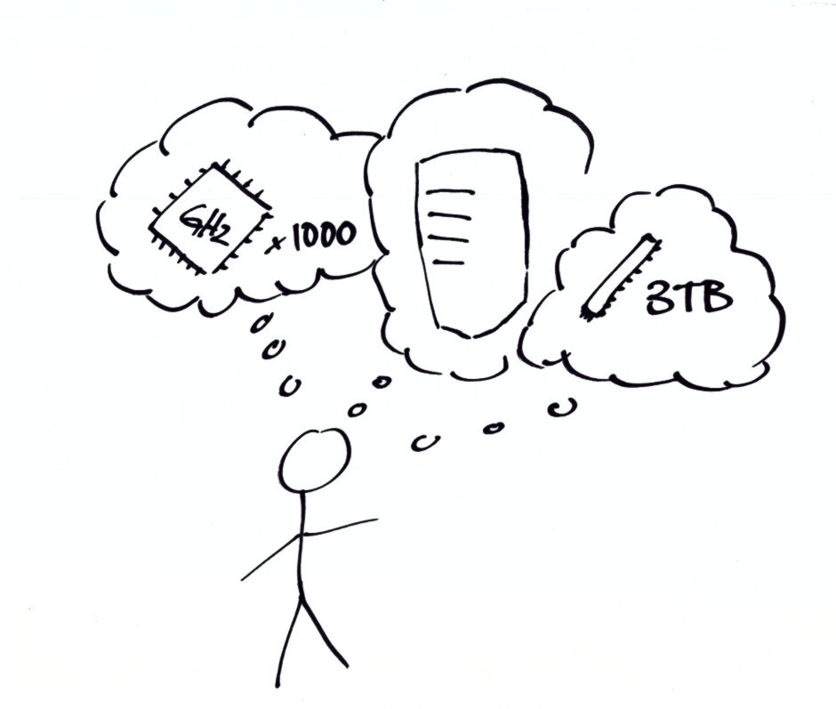
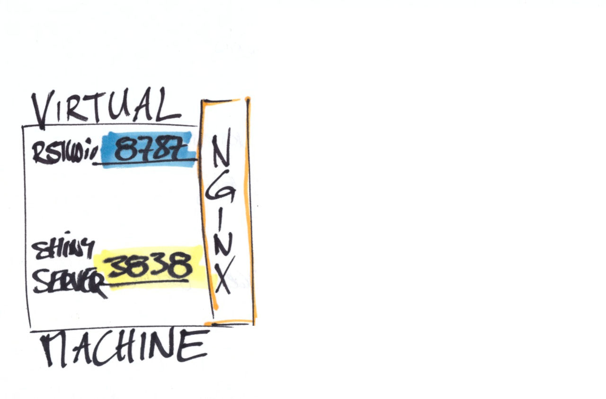
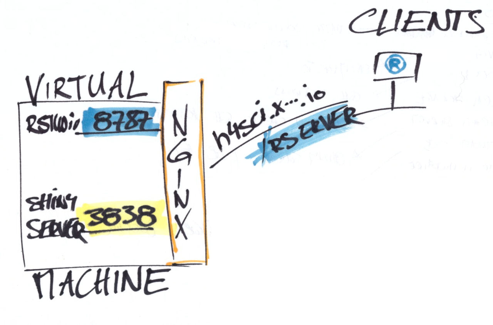
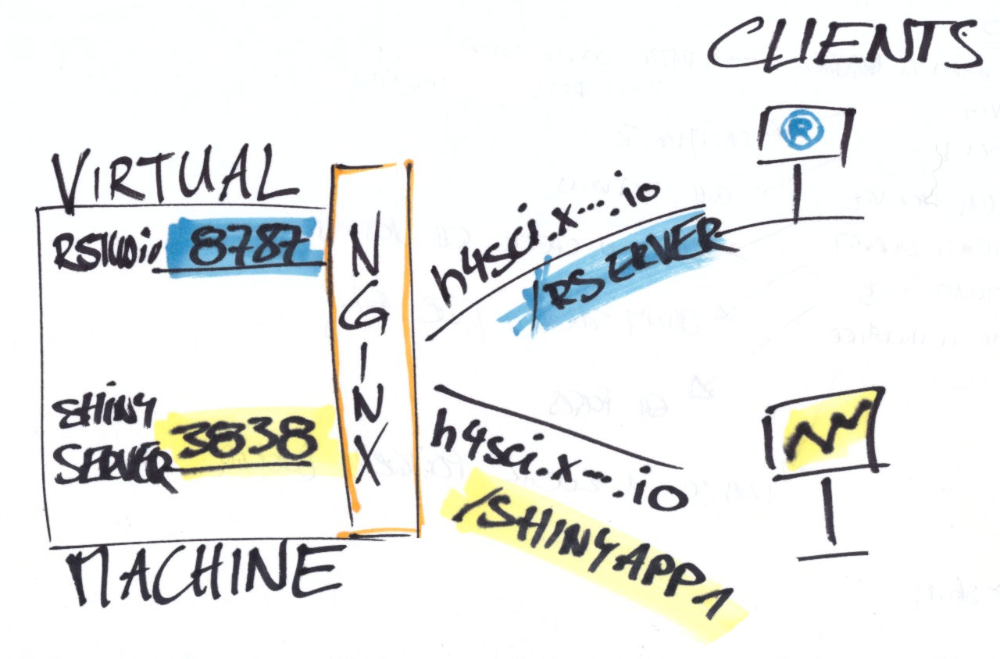

class:center,middle


**Today's goals**:</br>
Classify approaches 
</br> 
Get an idea of the infrastructure for team projects

<div class="my-footer"><span><div class="footer-text" align="right">"Hacking for Social Sciences" by Dr. Matthias Bannert is licensed under <a href="https://creativecommons.org/licenses/by-nc-sa/4.0/?ref=chooser-v1">CC BY-NC-SA 4.0</a></div></span></div> 


---


class:center,middle




Common thinking of servers... 


<div class="my-footer"><span><div class="footer-text" align="right">"Hacking for Social Sciences" by Dr. Matthias Bannert is licensed under <a href="https://creativecommons.org/licenses/by-nc-sa/4.0/?ref=chooser-v1">CC BY-NC-SA 4.0</a></div></span></div> 


---

class:center,middle


A server is a program that listens.


---


## Common Servers 


```{r,echo=FALSE}
library(kableExtra)
d <- data.frame(
  "server" = c("Apache",
               "nginx",
               "Postgres",
               "R Studio Server",
               "Shiny Server"),
  "common ports" = c("80, 443",
                     "80, 443",
                     "5432",
                     "3838",
                     "8787"),
  "Description" = c("Standard Webserver",
                    "Webserver, Reverse Project, often combined with other servers",
                    "Database Server for PostgreSQL",
                    "R Studio made available through a web browser",
                    "A server to run shiny apps"),
  stringsAsFactors = FALSE)
kable(d,"html",escape= FALSE)

```

Note: Many of these programs can be installed on your local computer easily and made 
available through your _localhost_ (IP: 127.0.0.1).


---

class:center,middle

## Basic Data Science Web Server Example





---


class:center,middle

## Basic Data Science Web Server Example





---


class:center,middle

## Basic Data Science Web Server Example





---

class:center,middle

# Hosting Approaches

Note: All of these approaches ask for a development environment.

---


class:center,middle

## On Premise (in house)

---

## On Premise 

### Examples

- ETH Gitlab
- Gitea
- teaching.kof.ethz.ch
- shiny server


---

class:center,middle

## Software-as-a-Service (SaaS)


---

## SaaS 


.pull-left[

### Examples

- Overleaf
- shinyapps.io


]

.pull-right[

### Advantages

- Hassle free (Hosting)
- Onboarding of non-hackers easier
- transparent pricing models


### Disadvantages

- Blackbox
- Vendor Lock-in depending on pricing model an software
- Relatively Expensive per Unit


]

---

class:center,middle

## Cloud

---


## Common Cloud Products


### Basic VMs

e.g., Google Compute Engine, Microsoft Azure Cloud VMs


### Single Purpose Environments

Docker hosts, e.g., Google Kubernetes Engine, Azure Kubernetes Service (AKS)


### Ready Made Services

AI & machine learning products, e.g., Google Cloud AutoML


---

class:center,middle

# Docker: containerize environments


