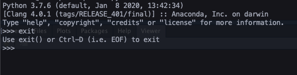
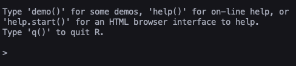
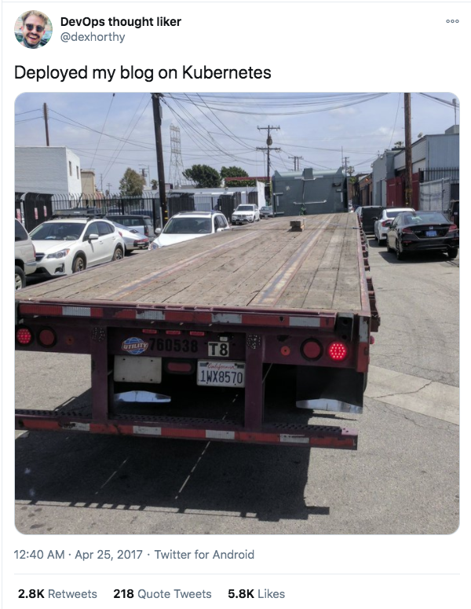
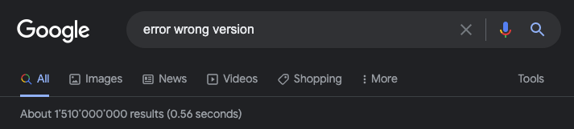
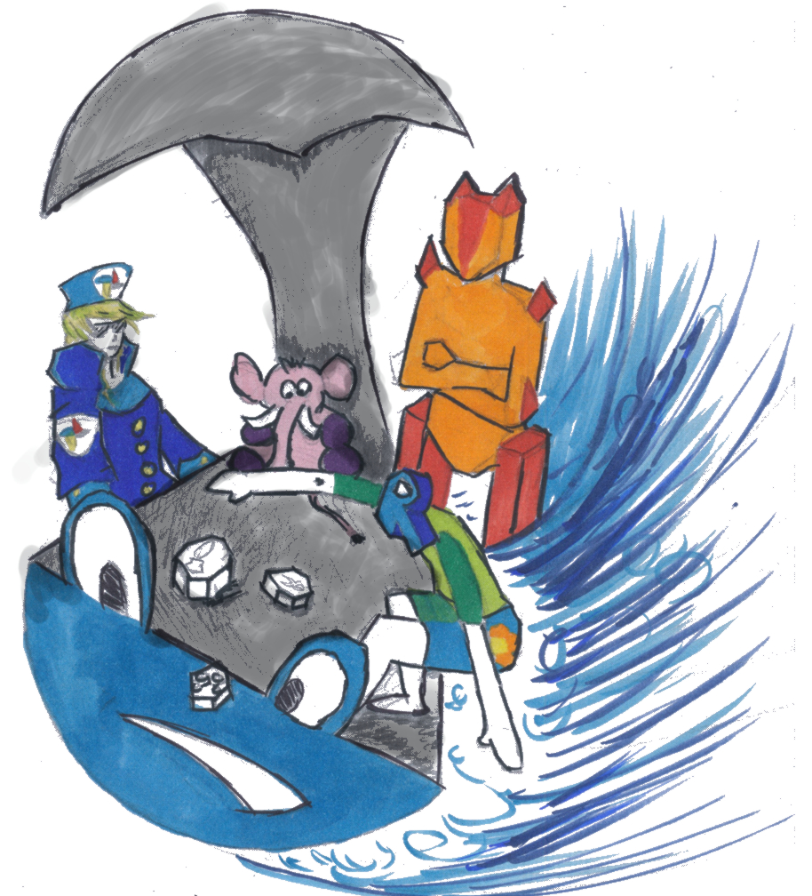

class:center,middle


**Today's goals**:</br>
Catch a Glimpse of DevOps</br>
Terminology and Contextualization 
</br> 
Get an idea of apt infrastructure for your team projects

<div class="my-footer"><span><div class="footer-text" align="right">"Hacking for Social Sciences" by Dr. Matthias Bannert is licensed under <a href="https://creativecommons.org/licenses/by-nc-sa/4.0/?ref=chooser-v1">CC BY-NC-SA 4.0</a></div></span></div> 


---


class:center,middle


## In Memory Representation of Data

[base R vs. data.table vs. tidyverse](https://h4sci.github.io/h4sci-course/block2_session_2.html#13)


<div class="my-footer"><span><div class="footer-text" align="right">"Hacking for Social Sciences" by Dr. Matthias Bannert is licensed under <a href="https://creativecommons.org/licenses/by-nc-sa/4.0/?ref=chooser-v1">CC BY-NC-SA 4.0</a></div></span></div> 


---


class:center,middle


## Reasons to Go Beyond Memory


<div class="my-footer"><span><div class="footer-text" align="right">"Hacking for Social Sciences" by Dr. Matthias Bannert is licensed under <a href="https://creativecommons.org/licenses/by-nc-sa/4.0/?ref=chooser-v1">CC BY-NC-SA 4.0</a></div></span></div> 


---


class:center,middle


## Persistency

```{r,echo=FALSE}

```

```{r,echo=FALSE}

```


<div class="my-footer"><span><div class="footer-text" align="right">"Hacking for Social Sciences" by Dr. Matthias Bannert is licensed under <a href="https://creativecommons.org/licenses/by-nc-sa/4.0/?ref=chooser-v1">CC BY-NC-SA 4.0</a></div></span></div> 


---


class:center,middle


## Size


<div class="my-footer"><span><div class="footer-text" align="right">"Hacking for Social Sciences" by Dr. Matthias Bannert is licensed under <a href="https://creativecommons.org/licenses/by-nc-sa/4.0/?ref=chooser-v1">CC BY-NC-SA 4.0</a></div></span></div> 


---


class:center,middle


<div class="my-footer"><span><div class="footer-text" align="right">"Hacking for Social Sciences" by Dr. Matthias Bannert is licensed under <a href="https://creativecommons.org/licenses/by-nc-sa/4.0/?ref=chooser-v1">CC BY-NC-SA 4.0</a></div></span></div> 


---


class:center,middle

<a href="https://twitter.com/thomasfuchs/status/928808041587314689"></a>


<div class="my-footer"><span><div class="footer-text" align="right">"Hacking for Social Sciences" by Dr. Matthias Bannert is licensed under <a href="https://creativecommons.org/licenses/by-nc-sa/4.0/?ref=chooser-v1">CC BY-NC-SA 4.0</a></div></span></div> 

---


class:center,middle


Common thinking of servers... 


<div class="my-footer"><span><div class="footer-text" align="right">"Hacking for Social Sciences" by Dr. Matthias Bannert is licensed under <a href="https://creativecommons.org/licenses/by-nc-sa/4.0/?ref=chooser-v1">CC BY-NC-SA 4.0</a></div></span></div> 


---

class:center,middle

## Availability

<div class="my-footer"><span><div class="footer-text" align="right">"Hacking for Social Sciences" by Dr. Matthias Bannert is licensed under <a href="https://creativecommons.org/licenses/by-nc-sa/4.0/?ref=chooser-v1">CC BY-NC-SA 4.0</a></div></span></div> 


---


class:center,middle


A server is a program that listens.

<div class="my-footer"><span><div class="footer-text" align="right">"Hacking for Social Sciences" by Dr. Matthias Bannert is licensed under <a href="https://creativecommons.org/licenses/by-nc-sa/4.0/?ref=chooser-v1">CC BY-NC-SA 4.0</a></div></span></div> 


---


## Common Servers 


```{r,echo=FALSE}
library(kableExtra)
d <- data.frame(
  "server" = c("Apache",
               "nginx",
               "Postgres",
               "R Studio Server",
               "Shiny Server"),
  "common ports" = c("80, 443",
                     "80, 443",
                     "5432",
                     "3838",
                     "8787"),
  "Description" = c("Standard Webserver",
                    "Webserver, Reverse Proxy, often combined with other servers",
                    "Database Server for PostgreSQL",
                    "R Studio made available through a web browser",
                    "A server to run shiny apps"),
  stringsAsFactors = FALSE)
kable(d,"html",escape= FALSE)

```

Note: Many of these programs can be installed on your local computer easily and made 
available through your _localhost_ (IP: 127.0.0.1).

<div class="my-footer"><span><div class="footer-text" align="right">"Hacking for Social Sciences" by Dr. Matthias Bannert is licensed under <a href="https://creativecommons.org/licenses/by-nc-sa/4.0/?ref=chooser-v1">CC BY-NC-SA 4.0</a></div></span></div> 

---


class:center,middle

## Basic Data Science Web Server Example


<div class="my-footer"><span><div class="footer-text" align="right">"Hacking for Social Sciences" by Dr. Matthias Bannert is licensed under <a href="https://creativecommons.org/licenses/by-nc-sa/4.0/?ref=chooser-v1">CC BY-NC-SA 4.0</a></div></span></div> 

---


class:center,middle

## Basic Data Science Web Server Example


<div class="my-footer"><span><div class="footer-text" align="right">"Hacking for Social Sciences" by Dr. Matthias Bannert is licensed under <a href="https://creativecommons.org/licenses/by-nc-sa/4.0/?ref=chooser-v1">CC BY-NC-SA 4.0</a></div></span></div> 

---


class:center,middle

## Basic Data Science Web Server Example


<div class="my-footer"><span><div class="footer-text" align="right">"Hacking for Social Sciences" by Dr. Matthias Bannert is licensed under <a href="https://creativecommons.org/licenses/by-nc-sa/4.0/?ref=chooser-v1">CC BY-NC-SA 4.0</a></div></span></div> 

---


class:center,middle

## Reproducibility

<div class="my-footer"><span><div class="footer-text" align="right">"Hacking for Social Sciences" by Dr. Matthias Bannert is licensed under <a href="https://creativecommons.org/licenses/by-nc-sa/4.0/?ref=chooser-v1">CC BY-NC-SA 4.0</a></div></span></div> 




---


class:center,middle

# Hosting Approaches

Note: All of these approaches ask for a development environment.


<div class="my-footer"><span><div class="footer-text" align="right">"Hacking for Social Sciences" by Dr. Matthias Bannert is licensed under <a href="https://creativecommons.org/licenses/by-nc-sa/4.0/?ref=chooser-v1">CC BY-NC-SA 4.0</a></div></span></div> 

---


class:center,middle

## On Premise (in house)


<div class="my-footer"><span><div class="footer-text" align="right">"Hacking for Social Sciences" by Dr. Matthias Bannert is licensed under <a href="https://creativecommons.org/licenses/by-nc-sa/4.0/?ref=chooser-v1">CC BY-NC-SA 4.0</a></div></span></div> 

---

## On Premise 

### Examples

- [ETH Gitlab](https://gitlab.ethz.ch/)
- [Gitea](https://gitea.io/en-us/)
- [teaching.kof.ethz.ch](https://teaching.kof.ethz.ch/auth-sign-in)
- [shiny server](https://rstudio.com/products/shiny/shiny-server/)


<div class="my-footer"><span><div class="footer-text" align="right">"Hacking for Social Sciences" by Dr. Matthias Bannert is licensed under <a href="https://creativecommons.org/licenses/by-nc-sa/4.0/?ref=chooser-v1">CC BY-NC-SA 4.0</a></div></span></div> 

---

class:center,middle

## Software-as-a-Service (SaaS)


<div class="my-footer"><span><div class="footer-text" align="right">"Hacking for Social Sciences" by Dr. Matthias Bannert is licensed under <a href="https://creativecommons.org/licenses/by-nc-sa/4.0/?ref=chooser-v1">CC BY-NC-SA 4.0</a></div></span></div> 

---

## SaaS / Serverless 


.pull-left[

### Examples

- [Overleaf](https://www.overleaf.com/)
- [shinyapps.io](https://www.shinyapps.io/)
- [Google NLP](https://cloud.google.com/natural-language/)


]

.pull-right[

### Advantages

- Hassle free (Hosting)
- Onboarding of non-hackers easier
- transparent pricing models


### Disadvantages

- Blackbox
- Vendor Lock-in depending on pricing model an software
- Relatively Expensive per Unit


]


<div class="my-footer"><span><div class="footer-text" align="right">"Hacking for Social Sciences" by Dr. Matthias Bannert is licensed under <a href="https://creativecommons.org/licenses/by-nc-sa/4.0/?ref=chooser-v1">CC BY-NC-SA 4.0</a></div></span></div> 

---

class:center,middle

## Cloud


<div class="my-footer"><span><div class="footer-text" align="right">"Hacking for Social Sciences" by Dr. Matthias Bannert is licensed under <a href="https://creativecommons.org/licenses/by-nc-sa/4.0/?ref=chooser-v1">CC BY-NC-SA 4.0</a></div></span></div> 

---


## Common Cloud Products


### Basic VMs

e.g., Google Compute Engine, Microsoft Azure Cloud VMs


### Single Purpose Environments

Docker hosts, e.g., Google Kubernetes Engine, Azure Kubernetes Service (AKS)


### Ready Made Services

AI & machine learning products, e.g., Google Cloud AutoML, SQL Cloud Hosting


<div class="my-footer"><span><div class="footer-text" align="right">"Hacking for Social Sciences" by Dr. Matthias Bannert is licensed under <a href="https://creativecommons.org/licenses/by-nc-sa/4.0/?ref=chooser-v1">CC BY-NC-SA 4.0</a></div></span></div> 

---


class:center,middle

# Docker: containerize environments




<div class="my-footer"><span><div class="footer-text" align="right">"Hacking for Social Sciences" by Dr. Matthias Bannert is licensed under <a href="https://creativecommons.org/licenses/by-nc-sa/4.0/?ref=chooser-v1">CC BY-NC-SA 4.0</a></div></span></div> 

---

class:center,middle


> A **container** is a **standard unit of software** that packages up code and all its dependencies so the application runs quickly and reliably from one computing environment to another

-- docker.com, what is a container ? 

<div class="my-footer"><span><div class="footer-text" align="right">"Hacking for Social Sciences" by Dr. Matthias Bannert is licensed under <a href="https://creativecommons.org/licenses/by-nc-sa/4.0/?ref=chooser-v1">CC BY-NC-SA 4.0</a></div></span></div> 

---


## Docker Basics


**Dockerfiles** are **recipes** for **docker images**. 

**Docker images** are **blueprints** for **containers**. 

Docker images can be **stored locally**, **built from scratch** or be **pulled** from a **Docker Registry** such as Docker Hub. 

Docker containers run on a Docker Host / Docker Desktop or in Docker Cluster like Docker Swarm or Kubernetes. 

<div class="my-footer"><span><div class="footer-text" align="right">"Hacking for Social Sciences" by Dr. Matthias Bannert is licensed under <a href="https://creativecommons.org/licenses/by-nc-sa/4.0/?ref=chooser-v1">CC BY-NC-SA 4.0</a></div></span></div> 

---


## A Basic Docker File Example


```

FROM rocker/r-ver:3.6.0 as deps
# A postgres client is needed as well to make timeseriesdb work 
# and connect remotely to the EXISTING KOF database
# -> we are not looking for a docker compose type of Postgres here.
RUN apt-get update && apt-get install -y \
libpq-dev \
libcurl4-openssl-dev \
libxml2-dev \
libssl1.0-dev \
libssh-dev

```


<div class="my-footer"><span><div class="footer-text" align="right">"Hacking for Social Sciences" by Dr. Matthias Bannert is licensed under <a href="https://creativecommons.org/licenses/by-nc-sa/4.0/?ref=chooser-v1">CC BY-NC-SA 4.0</a></div></span></div> 


---


## Docker commands


```{r,echo=FALSE}
d <- data.frame(
  command = c(
    "docker ps",
    "docker images",
    "docker pull",
    "docker run",
    "docker kill"
    ),
  description = c(
    "list containers",
    "list docker images",
    "pull docker image from registry",
    "run docker container based on image",
    "stop and remove container"
  )
  )

kable(d)


```


<div class="my-footer"><span><div class="footer-text" align="right">"Hacking for Social Sciences" by Dr. Matthias Bannert is licensed under <a href="https://creativecommons.org/licenses/by-nc-sa/4.0/?ref=chooser-v1">CC BY-NC-SA 4.0</a></div></span></div> 

---
  
## Two Docker Based Examples: PostgreSQL and Shiny Server

### Shiny

```
 docker run --rm -p 1234:3838 rocker/shiny

```
  
  
<div class="my-footer"><span><div class="footer-text" align="right">"Hacking for Social Sciences" by Dr. Matthias Bannert is licensed under <a href="https://creativecommons.org/licenses/by-nc-sa/4.0/?ref=chooser-v1">CC BY-NC-SA 4.0</a></div></span></div> 

---
  

## Two Docker Based Examples: PostgreSQL and Shiny Server

### Shiny

```
 docker run --rm -p 1234:3838 rocker/shiny

```
  
  
### Postgres Server  
  
```
docker run --rm  --name pg-docker -e POSTGRES_PASSWORD=postgres -d -p 1111:5432 
-v local/path:/var/lib/postgresql/data  postgres:11

```


-d: run as daemon, i.e., terminal window available

-e: pass on an environment parameter, in this case a password 

-p: port forwarding: host port:docker port

-v: Mount for persistent storage


<div class="my-footer"><span><div class="footer-text" align="right">"Hacking for Social Sciences" by Dr. Matthias Bannert is licensed under <a href="https://creativecommons.org/licenses/by-nc-sa/4.0/?ref=chooser-v1">CC BY-NC-SA 4.0</a></div></span></div> 
  


