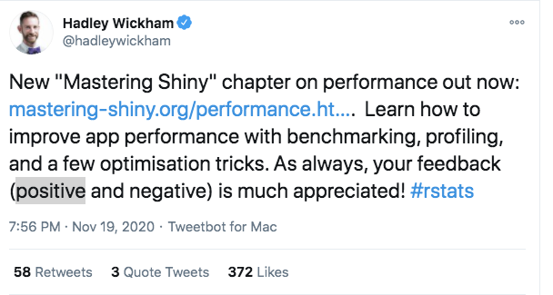

## Today's goal: Find an Infrastructure for Every Team Project

### GitHub Actions

- team web scraping
- team OECD data processing
- team R package creation

### Shiny Server

- team interactive data visualization
- team survey

### GitHub Pages

- team website / bookdown
- team wildfire data


<div class="my-footer"><span><div class="footer-text" align="right">"Hacking for Social Sciences" by Dr. Matthias Bannert is licensed under <a href="https://creativecommons.org/licenses/by-nc-sa/4.0/?ref=chooser-v1">CC BY-NC-SA 4.0</a></div></span></div> 


---


class:center,middle

# GitHub Actions

<div class="my-footer"><span><div class="footer-text" align="right">"Hacking for Social Sciences" by Dr. Matthias Bannert is licensed under <a href="https://creativecommons.org/licenses/by-nc-sa/4.0/?ref=chooser-v1">CC BY-NC-SA 4.0</a></div></span></div> 

---

## GitHub Actions (Live Demo)

### What is GitHub Actions?

Github Actions is a tool to automate and customize the software development workflow including 
CI/CD. It's similar to *Gitlab CI/CD*. 


### How Does Github Actions work? 

1. Prepare a task you want to run, e.g., an R script.
2. Configure an environment AND workflow in a simple .yaml text file
3. Push the file to a hidden folder .github/workflows (this won't be necessary if you edited the file directly on github0
4. Use the GitHub web GUI to monitor the process.


<div class="my-footer"><span><div class="footer-text" align="right">"Hacking for Social Sciences" by Dr. Matthias Bannert is licensed under <a href="https://creativecommons.org/licenses/by-nc-sa/4.0/?ref=chooser-v1">CC BY-NC-SA 4.0</a></div></span></div> 

---

class:center,middle

## https://crontab.guru/

cronjobs - execute on schedule. [GitHub Actions docs](https://docs.github.com/en/free-pro-team@latest/actions/reference/workflow-syntax-for-github-actions#onschedule)


<div class="my-footer"><span><div class="footer-text" align="right">"Hacking for Social Sciences" by Dr. Matthias Bannert is licensed under <a href="https://creativecommons.org/licenses/by-nc-sa/4.0/?ref=chooser-v1">CC BY-NC-SA 4.0</a></div></span></div> 


---


class:center,middle

## Github Pages 

<div class="my-footer"><span><div class="footer-text" align="right">"Hacking for Social Sciences" by Dr. Matthias Bannert is licensed under <a href="https://creativecommons.org/licenses/by-nc-sa/4.0/?ref=chooser-v1">CC BY-NC-SA 4.0</a></div></span></div> 


---


## Github Pages in a Nutshell
  
- every github repository can opt to have a repository specific website
- it is design to document and/or market the software developed in the repo
- the URL pattern is: user.github.io/repository-name
- GitHub Pages sites either reside on a separate _gh-pages_ branch or in 
the _docs folder_ on the main branch. 
- GitHub Pages can be activated through the Github GUI
- GitHub Pages can host either .md files or .html webpages (including .js and .css)

<div class="my-footer"><span><div class="footer-text" align="right">"Hacking for Social Sciences" by Dr. Matthias Bannert is licensed under <a href="https://creativecommons.org/licenses/by-nc-sa/4.0/?ref=chooser-v1">CC BY-NC-SA 4.0</a></div></span></div> 


---


class:center,middle

## shiny

<div class="my-footer"><span><div class="footer-text" align="right">"Hacking for Social Sciences" by Dr. Matthias Bannert is licensed under <a href="https://creativecommons.org/licenses/by-nc-sa/4.0/?ref=chooser-v1">CC BY-NC-SA 4.0</a></div></span></div> 


---


class:center,middle

## server.R (Why Do I have to Do All the Work ?)


  
  
<div class="my-footer"><span><div class="footer-text" align="right">"Hacking for Social Sciences" by Dr. Matthias Bannert is licensed under <a href="https://creativecommons.org/licenses/by-nc-sa/4.0/?ref=chooser-v1">CC BY-NC-SA 4.0</a></div></span></div> 


---

class:center,middle

## ui.R (I may be late, but I look gooooooood.)
  


<div class="my-footer"><span><div class="footer-text" align="right">"Hacking for Social Sciences" by Dr. Matthias Bannert is licensed under <a href="https://creativecommons.org/licenses/by-nc-sa/4.0/?ref=chooser-v1">CC BY-NC-SA 4.0</a></div></span></div> 


---


## What Does the shiny Framework Do for Us?


1. create HTML/CSS/Javascript code
2. start/run a (local) webserver
3. communication between the R session and the browser


<div class="my-footer"><span><div class="footer-text" align="right">"Hacking for Social Sciences" by Dr. Matthias Bannert is licensed under <a href="https://creativecommons.org/licenses/by-nc-sa/4.0/?ref=chooser-v1">CC BY-NC-SA 4.0</a></div></span></div> 


---


## A minimal note on HTML

- Markup language
- content is wrapped in tags

```
<a href="http://somedestination.com">some link</a>
<b>this is bold</b>
<i>this is italic</i>
<div class="some-class">a class with a style</div>
```

=> shiny functions create these wraps for us.


<div class="my-footer"><span><div class="footer-text" align="right">"Hacking for Social Sciences" by Dr. Matthias Bannert is licensed under <a href="https://creativecommons.org/licenses/by-nc-sa/4.0/?ref=chooser-v1">CC BY-NC-SA 4.0</a></div></span></div> 


---


## Breaking Down the Hello World App


.pull-left[

### ui.R


```{r,eval=FALSE,echo=TRUE}
library(shiny)
shinyUI(fluidPage(
  titlePanel("A random normal"),
  # Sidebar with a slider input for number of bins 
  sidebarLayout(
    sidebarPanel(
      sliderInput("obs",
                  "Number of obs:",
                  min = 1,
                  max = 1000,
                  value = 100)
    ),
    mainPanel(
      plotOutput("randomPlot")
    )
  )
))
```

]


<div class="my-footer"><span><div class="footer-text" align="right">"Hacking for Social Sciences" by Dr. Matthias Bannert is licensed under <a href="https://creativecommons.org/licenses/by-nc-sa/4.0/?ref=chooser-v1">CC BY-NC-SA 4.0</a></div></span></div> 


---


## Breaking Down the Hello World App


.pull-left[

### ui.R


```{r,eval=FALSE,echo=TRUE}
library(shiny)
shinyUI(fluidPage(
  titlePanel("A random normal"),
  # Sidebar with a slider input for number of bins 
  sidebarLayout(
    sidebarPanel(
      sliderInput("obs",
                  "Number of obs:",
                  min = 1,
                  max = 1000,
                  value = 100)
    ),
    mainPanel(
      plotOutput("randomPlot")
    )
  )
))
```

]


.pull-right[

### server.R

```{r,eval=FALSE,echo=TRUE}
shinyServer(function(input, output) {
    output$randomPlot <- renderPlot({
    hist(rnorm(input$obs),
         col = 'darkgray',
         border = 'white')
  })
})
```


]


<div class="my-footer"><span><div class="footer-text" align="right">"Hacking for Social Sciences" by Dr. Matthias Bannert is licensed under <a href="https://creativecommons.org/licenses/by-nc-sa/4.0/?ref=chooser-v1">CC BY-NC-SA 4.0</a></div></span></div> 


---


## Planning the App

**This course: dashboard structure**

- sidebar
- topbar
- main panel
- menu buttons / sub pages

<div class="my-footer"><span><div class="footer-text" align="right">"Hacking for Social Sciences" by Dr. Matthias Bannert is licensed under <a href="https://creativecommons.org/licenses/by-nc-sa/4.0/?ref=chooser-v1">CC BY-NC-SA 4.0</a></div></span></div> 


---


## The shinydashboard package


```{r,eval=FALSE,echo=TRUE}
library(shinydashboard)
dashboardPage(
  dashboardHeader(),
  dashboardSidebar(),
  dashboardBody()
)
```


<div class="my-footer"><span><div class="footer-text" align="right">"Hacking for Social Sciences" by Dr. Matthias Bannert is licensed under <a href="https://creativecommons.org/licenses/by-nc-sa/4.0/?ref=chooser-v1">CC BY-NC-SA 4.0</a></div></span></div> 


---

class:center,middle

## Are you ready for to build a real app?

[Take the official quiz by rstudio.com!](https://shiny.rstudio.com/tutorial/quiz/)


<div class="my-footer"><span><div class="footer-text" align="right">"Hacking for Social Sciences" by Dr. Matthias Bannert is licensed under <a href="https://creativecommons.org/licenses/by-nc-sa/4.0/?ref=chooser-v1">CC BY-NC-SA 4.0</a></div></span></div> 


---


class:center,middle

## Mastering Shiny


<a href="https://twitter.com/hadleywickham/status/1329498817113321472"></a>


<div class="my-footer"><span><div class="footer-text" align="right">"Hacking for Social Sciences" by Dr. Matthias Bannert is licensed under <a href="https://creativecommons.org/licenses/by-nc-sa/4.0/?ref=chooser-v1">CC BY-NC-SA 4.0</a></div></span></div> 


---


## More Shiny Resources


### Basics

- [Shiny Tutorial](http://shiny.rstudio.com/tutorial/)
- [Shiny Dashboards](https://rstudio.github.io/shinydashboard/)

### UIs / Gallery

- [Shiny Gallery](http://shiny.rstudio.com/gallery/)
- [Semantic UI (advanced)](https://github.com/Appsilon/shiny.semantic)


### Advanced Reads

- [Mastering Shiny (Hadley Wickham)](https://mastering-shiny.org/)
- [Engineering Shiny (Colin Fay et al.)](https://engineering-shiny.org/)


<div class="my-footer"><span><div class="footer-text" align="right">"Hacking for Social Sciences" by Dr. Matthias Bannert is licensed under <a href="https://creativecommons.org/licenses/by-nc-sa/4.0/?ref=chooser-v1">CC BY-NC-SA 4.0</a></div></span></div> 


