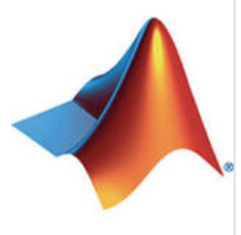
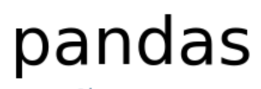
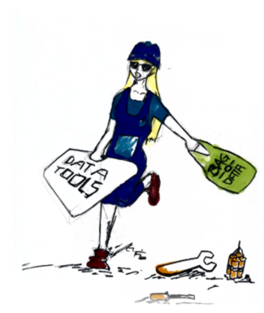
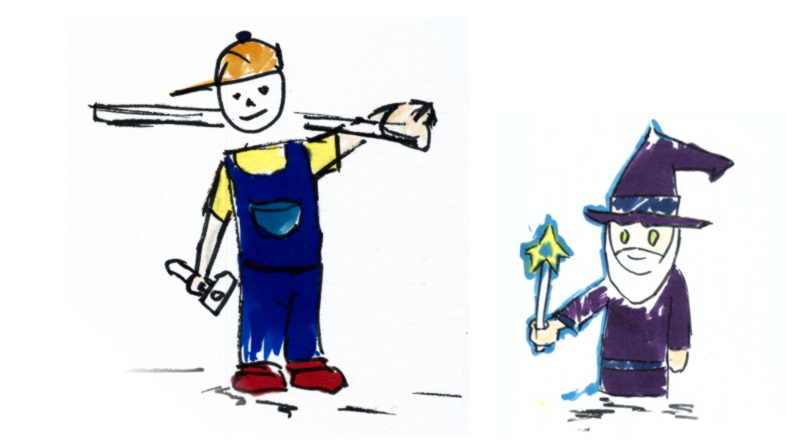
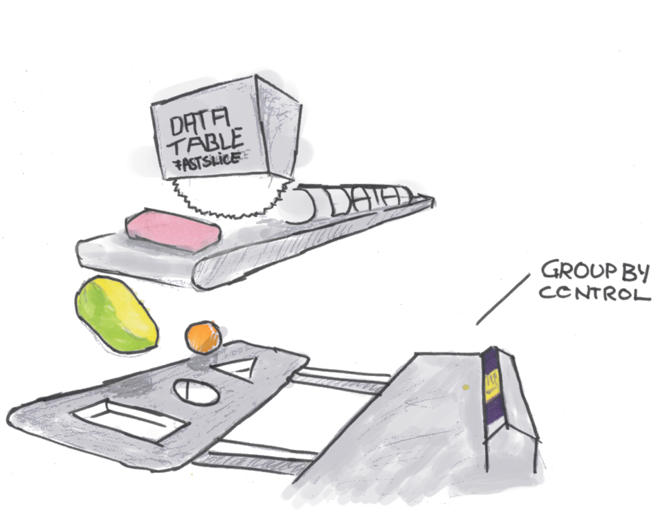

class: center, middle

## Slide URL: [https://h4sci.github.io/h4sci-course/block_1_session_2_bigpicture.html](https://h4sci.github.io/h4sci-course/block_1_session_2_bigpicture.html)
## Chapter URL: [https://h4sci.github.io/h4sci-book/stack-a-developers-toolkit.html](https://h4sci.github.io/h4sci-book/stack-a-developers-toolkit.html)

"Hacking for Social Sciences" by Dr. Matthias Bannert is licensed under <a href="https://creativecommons.org/licenses/by-nc-sa/4.0/?ref=chooser-v1">CC BY-NC-SA 4.0</a>

 

---

class: center, middle

            

All logos on this slide are taken from projects' or products' websites and ared share for the sake of recognizing them. Logos are NOT redistributed under a Creative Commons license.

 

---

## How to Compose the Right Toolbox ?

.pull-left[

- Programming Languages
- IDEs
- Code Management
- Databases
- Infrastructure
- Automation

]

.pull-right[

]

"Hacking for Social Sciences" by Dr. Matthias Bannert is licensed under <a href="https://creativecommons.org/licenses/by-nc-sa/4.0/?ref=chooser-v1">CC BY-NC-SA 4.0</a>

 

---

## Programming Languages

.pull-left[

compiled:

  - C++ 
  - FORTRAN
]

.pull-right[

interpreted:

  - R 
  - Python (uses reticulate REPL within R Studio)

]

Note:
- wrappers can help to use compiled functions inside interpreted languages.
- Extension repositories such as CRAN or piPy provide a broad variety of libraries.

"Hacking for Social Sciences" by Dr. Matthias Bannert is licensed under <a href="https://creativecommons.org/licenses/by-nc-sa/4.0/?ref=chooser-v1">CC BY-NC-SA 4.0</a>

 

---

## Editors and IDEs

  

People: "Oh, you're such a wizard." Me: "No, just a carpenter." 

 

**IDEs**: [VS Code](https://code.visualstudio.com/blogs/2017/11/15/live-share),
R Studio, pyCharm  **Text Editors**: Atom, [Sublime](https://www.sublimetext.com/), Notepad++, Text Wrangler

"Hacking for Social Sciences" by Dr. Matthias Bannert is licensed under <a href="https://creativecommons.org/licenses/by-nc-sa/4.0/?ref=chooser-v1">CC BY-NC-SA 4.0</a>

 

---

## Code Management

.pull-left[

## Git is NOT GitHub
## Git is NOT GitHub
## Git is NOT GitHub
## Git is NOT GitHub
## Git is NOT GitHub

]

.pull-right[

**Version Control Systems**

- **git**
- SVN
- CVS
- mercurial

**Git Platforms (git + web GUI + PM tools)**

- GitHub
- GitLab
- Bitbucket

[gitea](https://gitea.io/en-us/) is a self-hosted service (run a platform on your own server).

]

"Hacking for Social Sciences" by Dr. Matthias Bannert is licensed under <a href="https://creativecommons.org/licenses/by-nc-sa/4.0/?ref=chooser-v1">CC BY-NC-SA 4.0</a>

 

---

## Databases

.pull-left[

Relational Database Management Systems
- Oracle
- MS SQL Server
- PostgreSQL
- MySQL
- sqlite
]

.pull-right[

Non-Relational Databases

- MongoDB
- Redis
- Amazon Redshift
  
]

"Hacking for Social Sciences" by Dr. Matthias Bannert is licensed under <a href="https://creativecommons.org/licenses/by-nc-sa/4.0/?ref=chooser-v1">CC BY-NC-SA 4.0</a>

 

---

## Virtual Infrastructure

.pull-left[

Technology

- VirtualBox
- [Docker](https://docker.com)
]

.pull-right[

Clouds

- AWS
- GPC
- Microsoft Azure
- Exoscale
]

"Hacking for Social Sciences" by Dr. Matthias Bannert is licensed under <a href="https://creativecommons.org/licenses/by-nc-sa/4.0/?ref=chooser-v1">CC BY-NC-SA 4.0</a>

 

---

## Automation

.pull-right[

]

.pull-right[

Process Automation

- [Cronjobs](https://crontab.guru/)
- Apache Airflow

Release Automation

- Gitlab CI
- GitHub Actions

Infrastructure Automation

- Terraform
- Ansible

]

"Hacking for Social Sciences" by Dr. Matthias Bannert is licensed under <a href="https://creativecommons.org/licenses/by-nc-sa/4.0/?ref=chooser-v1">CC BY-NC-SA 4.0</a>

 

---

## Support

- [Stackoverflow.com](https://stackoverflow.com/questions/15376075/cluster-analysis-in-r-determine-the-optimal-number-of-clusters/36729465#36729465)
- Mailing lists
- community groups: RLadies, WhyR, MiR, FoRwards, AfricaR
- Documentation, Content Aggregators, e.g., [CTV](https://cran.r-project.org/web/views/), [Python Graph Gallery](https://python-graph-gallery.com/)

"Hacking for Social Sciences" by Dr. Matthias Bannert is licensed under <a href="https://creativecommons.org/licenses/by-nc-sa/4.0/?ref=chooser-v1">CC BY-NC-SA 4.0</a>

 

---

class:center,middle

> "Premature optimization is the root of all evil."

-- Donald Knuth

"Hacking for Social Sciences" by Dr. Matthias Bannert is licensed under <a href="https://creativecommons.org/licenses/by-nc-sa/4.0/?ref=chooser-v1">CC BY-NC-SA 4.0</a>

 

