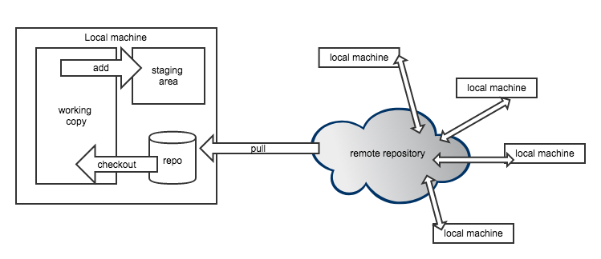
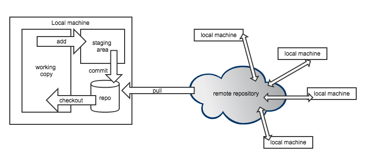

class:center,middle

Today's goal: be able to clear [tasks 1-3](https://github.com/h4sci/h4sci-tasks/issues)

"Hacking for Social Sciences" by Dr. Matthias Bannert is licensed under <a href="https://creativecommons.org/licenses/by-nc-sa/4.0/?ref=chooser-v1">CC BY-NC-SA 4.0</a>

 

---

class:center,middle

## What is git ? 

"Hacking for Social Sciences" by Dr. Matthias Bannert is licensed under <a href="https://creativecommons.org/licenses/by-nc-sa/4.0/?ref=chooser-v1">CC BY-NC-SA 4.0</a>

 

---

class:center,middle

> Git is a decentralized version control system.  

"Hacking for Social Sciences" by Dr. Matthias Bannert is licensed under <a href="https://creativecommons.org/licenses/by-nc-sa/4.0/?ref=chooser-v1">CC BY-NC-SA 4.0</a>

 

---

## Basic Git Workflow: init, pull, clone

 

"Hacking for Social Sciences" by Dr. Matthias Bannert is licensed under <a href="https://creativecommons.org/licenses/by-nc-sa/4.0/?ref=chooser-v1">CC BY-NC-SA 4.0</a>

 

---

## Basic Git Workflow: checkout

"Hacking for Social Sciences" by Dr. Matthias Bannert is licensed under <a href="https://creativecommons.org/licenses/by-nc-sa/4.0/?ref=chooser-v1">CC BY-NC-SA 4.0</a>

 

---

## Basic Git Workflow: add (staging)

"Hacking for Social Sciences" by Dr. Matthias Bannert is licensed under <a href="https://creativecommons.org/licenses/by-nc-sa/4.0/?ref=chooser-v1">CC BY-NC-SA 4.0</a>

 

---

## Basic Git Workflow: commit

"Hacking for Social Sciences" by Dr. Matthias Bannert is licensed under <a href="https://creativecommons.org/licenses/by-nc-sa/4.0/?ref=chooser-v1">CC BY-NC-SA 4.0</a>

 

---

## Basic Git Workflow: push

"Hacking for Social Sciences" by Dr. Matthias Bannert is licensed under <a href="https://creativecommons.org/licenses/by-nc-sa/4.0/?ref=chooser-v1">CC BY-NC-SA 4.0</a>

 

---

class:center,middle

**Wait.**  
Are you able to set up a working RSA key pair based auth?  
If yes, move on.  
If not, watch [Connect to Remote Repository Using an RSA Key Pair](https://www.youtube.com/watch?v=oLEhNj17vVI)

"Hacking for Social Sciences" by Dr. Matthias Bannert is licensed under <a href="https://creativecommons.org/licenses/by-nc-sa/4.0/?ref=chooser-v1">CC BY-NC-SA 4.0</a>

 

---

class: center,middle

## Break Out Session 1: Task 1 - Moving Around 

---

class: center,middle

## Break Out Session 2: Task 2 & 3 - First Collab & Merge Conflict Drill

